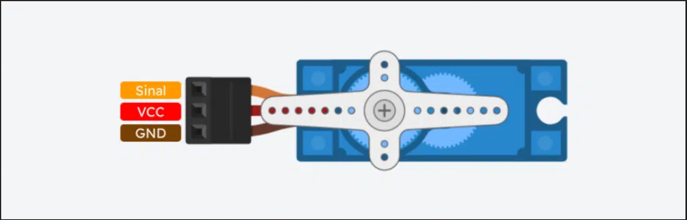
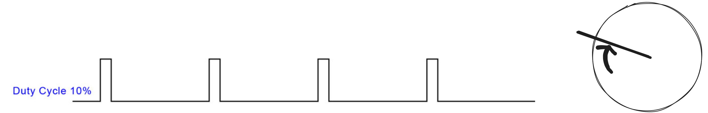
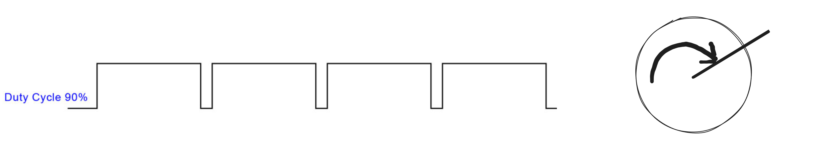
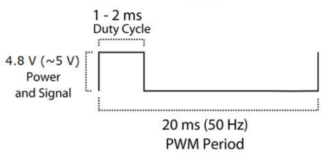

# Servo Motor Remoto

Servo motores são motores capazes de controlar com precisão a posição angular, velocidade e, em alguns casos, o torque. Eles são amplamente utilizados em aplicações onde é necessário movimento controlado e preciso. Servo motores tem vários usos como em robótica para movimento de braços robóticos e em modelismo para controlar os ailerons de aeromodelos. Nesta atividade você vai aprender a controlar um servo motor utilizando o FPGA.

## Como funciona o servo motor

O servo que iremos utilizar possui três pinos: VCC, GND e Sinal. Os dois primeiros são de alimentação e o terceiro é responsável por controlar a posição do motor. Veja a figura abaixo.

O sinal elétrico que vai no terceiro pino é um sinal PWM (*Pulse Width Modulation*), cujo duty cycle define a posição do braço do motor. Por exemplo, para um motor servo, um pulso muito curto pode significar posicionar o braço no início da excursão e um pulso largo pode significar posicionar o braço no final da excursão. Veja as figuras abaixo.

## O servo específico

Iremos utilizar nesta atividade o micro servo 9g SG90 cuja documentação pode ser encontrada [aqui](http://www.ee.ic.ac.uk/pcheung/teaching/DE1_EE/stores/sg90_datasheet.pdf), adequado para realizar testes iniciais e se familiarizar com servo motores. As imagens acima serviram apenas de exemplo, e agora iremos para as especificações reais.

- A frequência do pulso de PWM deve ser de 50Hz, ou seja, um período de 20 ms;
- A largura do pulso de PWM deve ser de 1ms (5%) para escursão mínima e de 2ms (10%) para excursão máxima

Veja a imagem abaixo ilustrando o uso do servo real.

## Atividade

Nesta atividade você deverá implementar um módulo que gere um sinal PWM capaz de controlar o servo motor. O sinal PWM deve:

- Ficar na escursão mínima por 5 segundos;
- Em seguida ficar na excursão máxima por 5 segundos;
- Voltar para a excursão mínima e recomeçar o ciclo

> Dica: adapte o módulo PWM desenvolvido no exercício anterior como submódulo neste exercício

> Dica: preste muita atenção aos valores do contador para atualizar a saida do PWM. Use o testbench para comparar as saídas e ver se foram colocados os valores corretos.

Na montagem do laboratório, há uma seta branca colada no braço do servo para ser mais fácil de identificar a sua posição.

**Lembre-se de seguir as especificações do servo motor!**

## Entrega

Primeiro, faça o *push* do seu código no repositório do **GitHub Classroom** para que o código seja carregado na placa. Veja o comportamento no site [embarcatechfpga.lsc.ic.unicamp.br](https://embarcatechfpga.lsc.ic.unicamp.br). Se tiver dúvidas de como utilizar a infraestrutura, veja este guia [aqui](guia_remoto.md).

Depois, confira o sistema de correção automática, que irá validar sua implementação e atribuir uma nota com base nos testes.

> **Dica:**  
Não altere os arquivos de correção! Para entender como os testes funcionam, consulte o script `run.sh` disponível no repositório.

