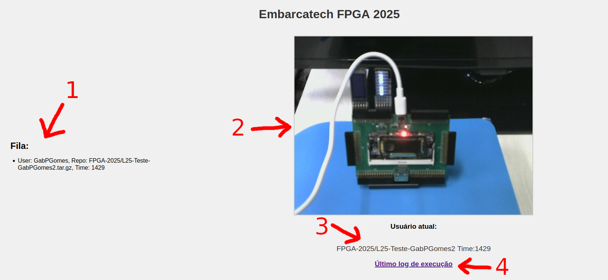

# Guia do Laboratório Online

Para acessar o laboratório online, você precisará:

1. Ter criado a atividade do Github Classroom e estar usando o repositório correspondente
2. Acessar o site com a filmagem em [embarcatechfpga.lsc.ic.unicamp.br](https://embarcatechfpga.lsc.ic.unicamp.br)

## O site

Essa é a aparência do site:

1. Aqui é mostrada uma fila de tarefas que o laboratório online irá executar. Ele carrega um laboratório de cada vez em ordem de chegada, de acordo com o horário que está no formato HH:MM, mostrado em 'Time'. Use essa parte do site para identificar se o seu laboratório foi enviado com sucesso.

2. Essa janela mostra a FPGA em tempo real para poder saber se ela for carregada com sucesso. Quando todos os leds estão piscando ao mesmo tempo significa que não tem nenhum código de usuário executando. Também aparece uma mensagem "Fila vazia. Aguardando o próximo Job".

3. Essa parte do site mostra qual laboratório está sendo executado naquele momento juntamente com o horário que ele foi enviado. Use o horário para identificar o laboratório específico.

4. Caso aconteça algo que não foi esperado (e.g. o usuário atual mudou mas a placa não carregou) você pode abrir o link "Último log de execução" e ver qual mensagem de erro aparece ao final da página.

## Como usar
Para usar a placa o procedimento é bastante simples.

1. Crie o seu repositório com a atividade e coloque o seu arquivo `.v` na raiz do repositório, da mesma forma que nos laboratórios anteriores.
2. Faça o git push das modificações. Automaticamente o seu código vai para a fila por meio de um acionamento do Github Actions (esse processo demora alguns segundos). 
3. Aguarde até ser o primeiro da fila e, quando o seu usuário foi o usuário atual, veja a placa carregar com o seu código.
4. A placa fica com o código do usuário atual durante um minuto antes de passar para o próximo usuário.

Lembre-se que o log de execução pode dar alguma dica do que aconteceu caso o seu código não carregue na placa. Repasse o erro encontrado para os monitores.